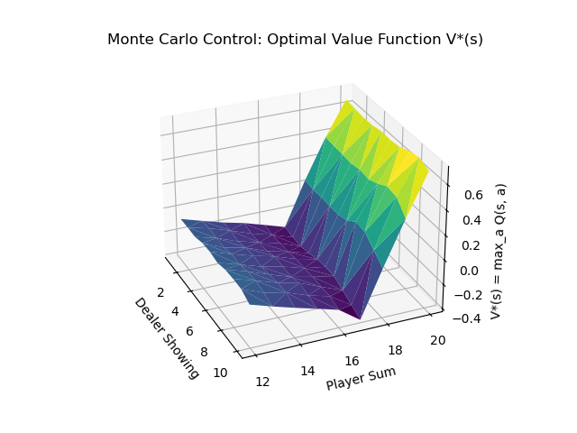
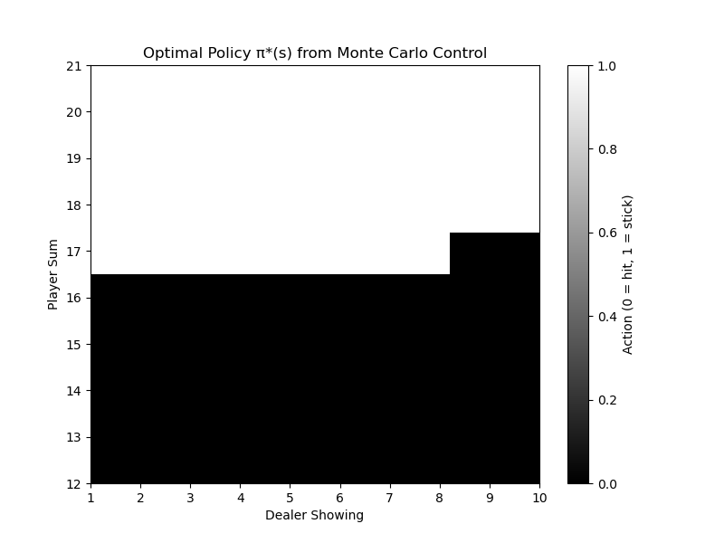

# Easy21 - Monte Carlo Control

This repository contains an implementation of **Monte Carlo (MC) Control** for the **Easy21** assignment from **David Silver's Reinforcement Learning course** .

Easy21 is a simplified Blackjack-like environment designed to help understand model-free reinforcement learning algorithms. 

The game involves a player and dealer drawing cards, with the goal of maximizing the player’s score while avoiding going bust.

## Results

### Optimal Value Function

The plot shows the learned value function for each state after training on 1 million episodes.

### Optimal Policy

This heatmap represents the optimal policy. White = stick, black = hit.
